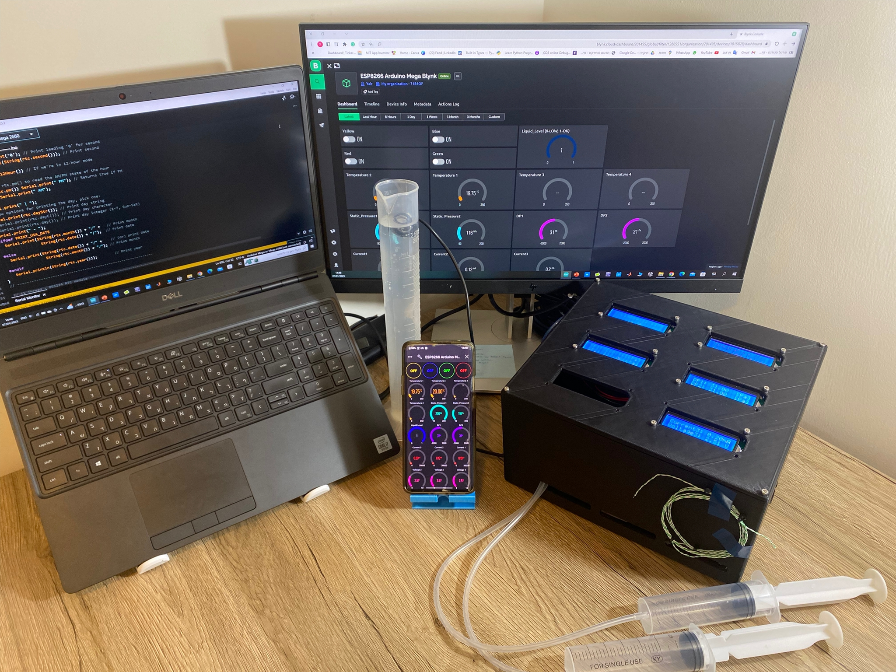
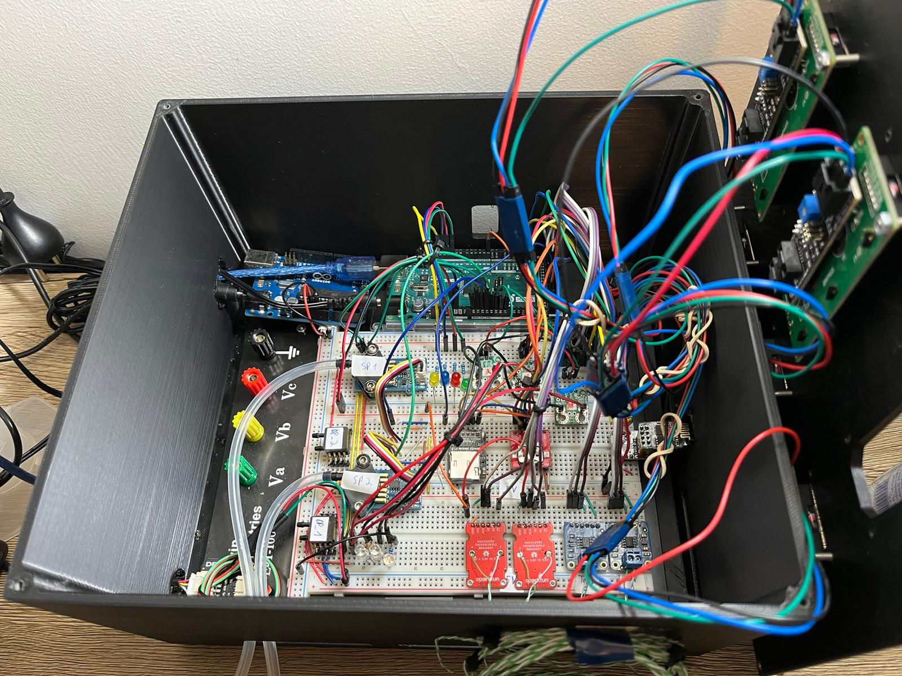
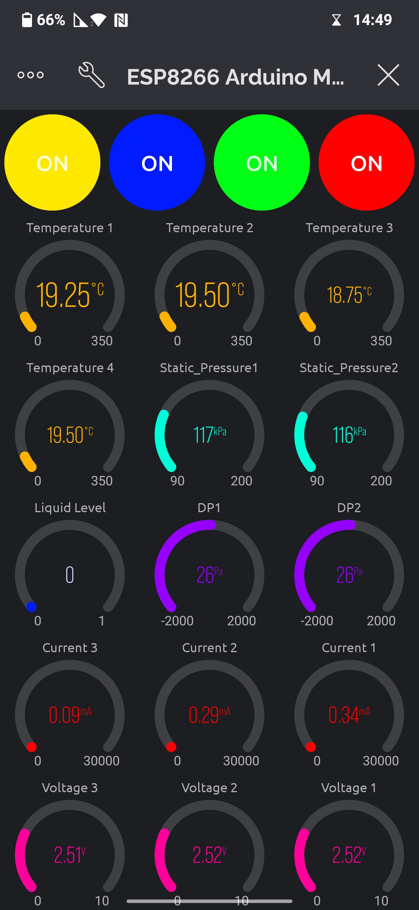
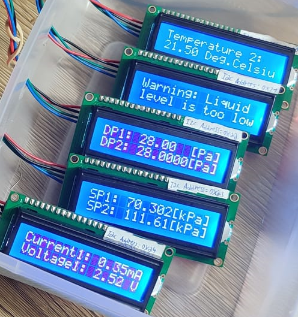
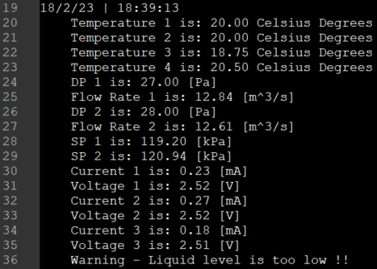

# Arduino_Project
Arduino Mega project for control &amp; management system to test a novel hydrogen generator.

B.Sc degree final project - I designed and developed a dedicated control and management system for a hydrogen generator using the Internet of Things (IoT) protocol. The system is responsible for monitoring several data points related to the generator's operation, including temperature, voltage/current, flow rate, liquid level, and static pressure. All this data is collected in real-time and can be accessed and analyzed through various means, such as a remote application, web dashboard, LCDs, and SD-card.

The control and management system functions as intended. The sensors are providing accurate results, and the data is being transmitted successfully to the Arduino Mega. The Arduino Mega sends the data to various displays, including LCDs, Blynk cloud, a remote application, and a web dashboard. Additionally, the data is recorded onto an SD-card-based data logger for future reference. Overall, the system is working well and providing valuable information.

Project set-up:

Hardware:

Remote application:

LCDs display:

Data-logger:

